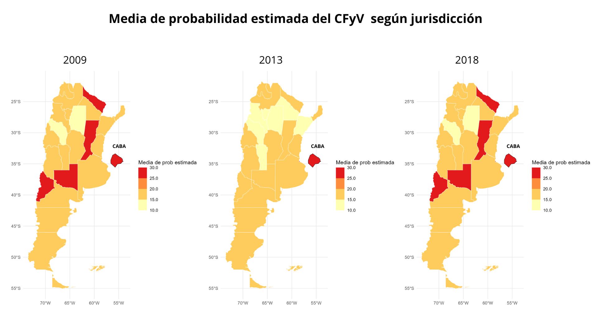

# Consumo de frutas y verduras en Argentina (2009-2018)

Esta investigacion analiza los patrones de consumo de frutas y verduras en la población adulta argentina a lo largo del tiempo, y cómo estos se relacionan con variables sociales, económicas y territoriales. Se basa en el análisis de datos de la Encuesta Nacional de Factores de Riesgo (ENFR), entre otros relevamientos oficiales.

## Objetivo

Estudiar si el cumplimiento del consumo mínimo recomendado por la OMS (400g diarios) está asociado a factores como:

- Nivel socioeconómico del hogar
- Género
- Jurisdiccion de residencia
- Cantidad de hectareas implantadas (EAP frutihortícolas)

## Bases de datos

- Encuesta Nacional de Factores de Riesgo (ENFR 2009, 2013, 2018)
- Censo Nacional (2010) – Necesidades Básicas Insatisfechas (NBI)
- Censo Nacional Agropecuario – Superficie cultivada frutihortícola (2008, 2018)

## Herramientas y paquetes

- `R` y `R Markdown`
- `tidyverse` (manipulación de datos y visualizaciones)
- `glmmTMB` (modelado estadístico)
- `DHARMa`, `emmeans` (validación de modelos y estimación marginal)

## Análisis y resultados

- Se modeló el cumplimiento con GLMMs de distribución binomial.
- Se identificaron desigualdades sociales: las personas de mayor ingreso, mayor nivel educativo y sin carencias estructurales tienen más probabilidades de cumplir con la recomendación.
- Las desigualdades crecieron entre 2009 y 2018.
- Las mujeres presentaron mayor cumplimiento que los varones en todos los años.
- No se halló relación significativa con el NBI provincial.
- La superficie frutihortícola mostró una relación contraria a lo esperado, probablemente por limitaciones en la variable.

### Mapa de probabilidades estimadas

> **Figura:** Probabilidad estimada de cumplimiento del consumo mínimo recomendado de frutas y verduras en un día típico, según provincia, a partir del modelo ajustado. Los valores fueron obtenidos mediante predicción marginal ajustada (`emmeans`) y representan diferencias territoriales luego de controlar por otras variables sociodemográficas.

## Archivos

- [`informe_tesis.html`](./informe/Resumen_tesis.html): Informe interactivo en HTML (no visible en GitHub, requiere descarga)
- [`informe_tesis.pdf`](./informe/Resumene_tesis.pdf): Informe completo en PDF listo para lectura
- `procesamiento_datos.Rmd`: Limpieza, recodificación y armado de las bases (en preparación)

---

> 📌 Este proyecto forma parte de mi tesis de grado en Ciencias Biológicas por la universidad de Buenos Aires (Fcen)(orientación en Salud Pública y Bioestadística) y representa mi transición profesional hacia el análisis de datos aplicado a problemas sociales y de salud.
