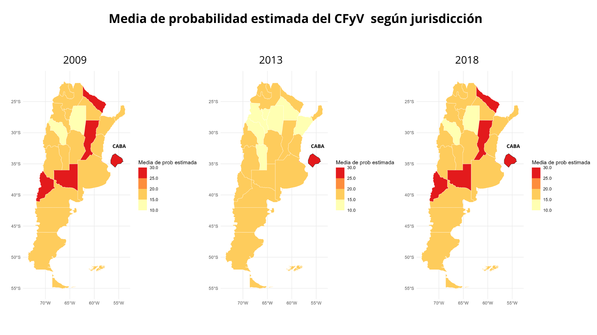

# El consumo frutihortícola en Argentina (2009-2018)🥦🍎

Esta investigacion —y proyecto— analiza los patrones de consumo de frutas y verduras en la población adulta argentina en los años 2009, 2013 y 2018, y cómo estos se relacionan con variables socioeconómicas y territoriales, desde un enfoque *eco-epidemiológico*. Se basa en el análisis de datos relevados en la Encuesta Nacional de Factores de Riesgo (ENFR), entre otros relevamientos oficiales.

Se aplicaron **Modelos Lineales Generalizados y Mixtos (GLMMs)** simples, aditivos y con interaccion (complejos). Se identificó el modelo con mejor ajuste **explicativo** para estimar la probabilidad de cumplir con la recomendación diaria mínima de consumo de frutas y verduras.

## Objetivo

Estudiar como el cumplimiento del consumo mínimo recomendado por la OMS (400g diarios) está asociado a factores como:
- Nivel socioeconómico a nivel individual, hogar y provincial
- Género
- Edad
- Nivel máximo de instrucción alcanzado.
- Condiciones extructurales de la vivienda
- Superficie frutihorticola cultivada en cada provincia

## Bases de datos 🗃️

- Encuesta Nacional de Factores de Riesgo (**ENFR** ~ 2009, 2013, 2018)
- Censo Nacional (**CN** ~ 2010) – Necesidades Básicas Insatisfechas (NBI por provincia)
- Censo Nacional Agropecuario (**CNA** ~ 2009, 2018) – Superficie cultivada frutihortícola 

## Herramientas y paquetes 🧠

- `R` y `R Markdown`
- `tidyverse` (manipulación de datos y visualizaciones)
- `glmmTMB` (modelado estadístico)
- `DHARMa`, `emmeans` (validación de modelos y estimación marginal)

## Procesamiento de datos ⚙️

El procesamiento de las bases de datos incluyó:

- Limpieza y selección de variables clave
- Estandarización de variables comunes entre encuestas
- Recodificación de categorías y construcción de un índice compuesto de NBI estructural a nivel dela vivienda
- Unión de fuentes externas por provincia y año

Todo el flujo está documentado en:

📂 [`/procesamiento_de_datos/`](./procesamiento_de_datos/)

- [`limpieza_ENFR.Rmd`]: limpieza y recodificación de las tres bases ENFR
- [`limpieza_CNA_CN.Rmd`]: procesamiento de datos del CNA y Censo 2010
- [`union_final.Rmd`]: combinación final para análisis

Los datos procesados se guardaron en `/datos_procesados/` para ser usados directamente en modelos o visualizaciones.

---
## Seleccion de modelos

El criterio utilizado para seleccionar y analizar el o los *modelos* a estudiar en cada sección fue el *Criterio de Información de Akaike* (**AIC**). Por su parte, la magnitud del efecto se estimó mediante el cálculo de los *Odds Ratio Ajustados*, con sus respectivos intervalos de confianza (**IC 95%**).

## Análisis y resultados 📊

- La muestra final estuvo integrada por n = 94.463 encuestados/as mayores de 18 años de centros urbanos de más de 5.000 habitantes del territorio Argentino.
- Se modeló el cumplimiento con GLMMs de distribución binomial.
- Se identificaron desigualdades sociales: las personas de mayor ingreso, mayor nivel educativo y sin carencias estructurales de la vivienda tienen más probabilidades de cumplir con la recomendación.
- Las desigualdades, entre las personas de mayor y menor ingreso, crecieron entre 2009 y 2018.
- Las mujeres presentaron mayor cumplimiento que los varones en todos los años bajo estudio.
- No se halló relación significativa con el NBI provincial.
- La superficie frutihortícola mostró una relación contraria a lo esperado, probablemente por limitaciones en la variable.

### Mapa de probabilidades estimadas

> **Figura:** Probabilidad estimada, a partir del modelo seleccionado, de cumplimiento del consumo mínimo recomendado de frutas y verduras en un día típico, según provincia. Los valores fueron obtenidos mediante predicción marginal ajustada (`emmeans`) y representan diferencias territoriales luego de controlar por otras variables sociodemográficas.

## Reflexiones finales y recomendaciones 

Esta investigación aporta evidencia de desigualdades persistentes en el acceso a una alimentación saludable en Argentina entre 2009 y 2018, asociadas a determinantes socioeconómicos a nivel individual, del hogar.

El cumplimiento del consumo recomendado de frutas y verduras (CFyV) aumentó con:
- Mayor ingreso
- Mayor nivel educativo
- Mejores condiciones estructurales de la vivienda
- Mayor edad

Además, se observó un mayor cumplimiento en mujeres a partir del segundo quintil de ingresos.

No se halló asociación significativa entre el CFyV y el NBI provincial, posiblemente por las limitaciones metodológicas de usar variables agregadas a gran escala.

La relación entre CFyV y superficie cultivada de EAP frutihortícolas fue inversa a lo esperado, provincias con menos hectareas frutihorticolas tuvieron un mayor consumo. Este resultado evidencia la necesidad de incorporar variables que den cuenta de la disponibilidad real de frutas y verduras. Por lo que se plantea incluir variables de produccion provenientes de los Núcleos Agropecuarios Familiares (NAF), responsables del 47% de la producción hortícola y del abastecimiento de alimentos frescos y de cercanía.

En el marco de la prevención de **Enfermedades Crónicas No Transmisibles**, y considerando los hallazgos de este estudio y los datos oficiales (ENFR, 2018), se propone:
- Impulsar políticas públicas que reduzcan desigualdades alimentarias
- Promover el cumplimiento del Derecho a la Alimentación Adecuada para toda la poblacion en su conjunto
- Apoyar y fortalecer el sector frutihortícola de cercanía, que representa un actor clave para garantizar el acceso equitativo a alimentos frescos y de estación

Una alimentación saludable no solo mejora la salud poblacional, sino que reduce la presión y el gasto sobre los sistemas sanitarios, y facilita el ejercicio progresivo de otros derechos ciudadanos.

## Archivos 📁

- [`Resumen_tesis.html`](./informe/Resumen_tesis.html): Informe completo interactivo (requiere descarga)
- [`Resumen_tesis.pdf`](./informe/Resumen_tesis.pdf): Informe listo para lectura
- [`/procesamiento_de_datos/`](./procesamiento_de_datos/): Scripts de limpieza, recodificación y unión de las bases
- [`/datos_procesados/`](./procesamiento_de_datos/datos_procesados/): Bases limpias y listas para análisis
- [`/resultados/`](./resultados/): Mapas, figuras y gráficos del análisis final

---

> 📌 Este proyecto nace de mostrar y compartir los resultados de mi tesis de grado en **Ciencias Biológicas por la universidad de Buenos Aires - FCEN** con orientación en Salud Pública y Bioestadística, y representa **mis primeros pasos en la transición profesional**.
